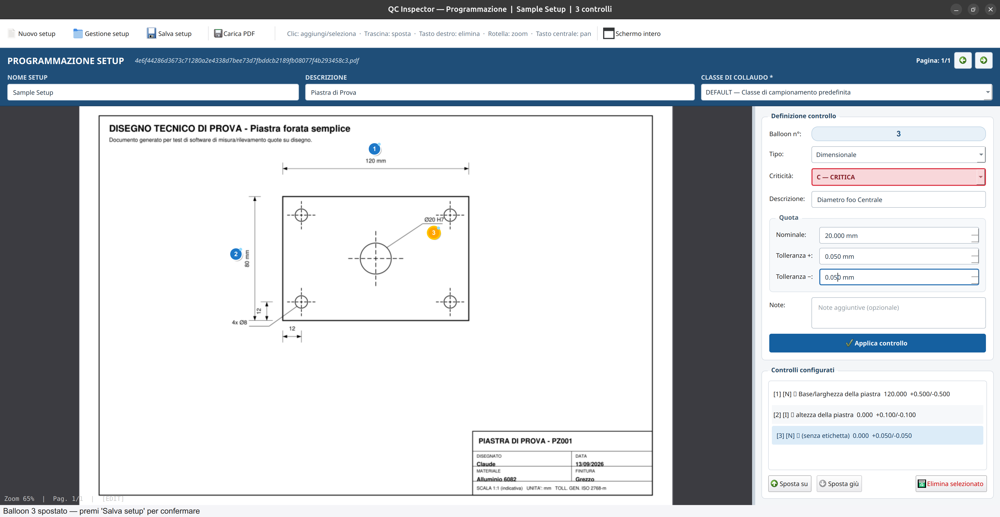
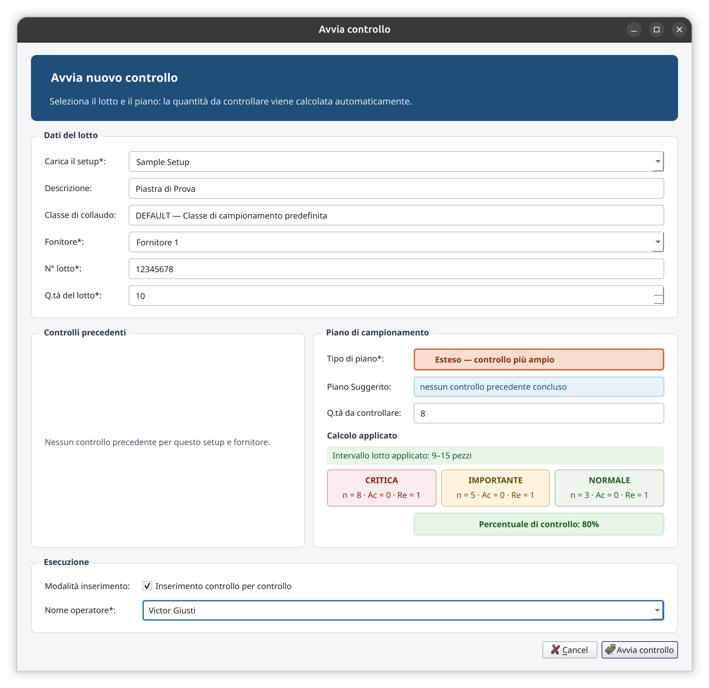
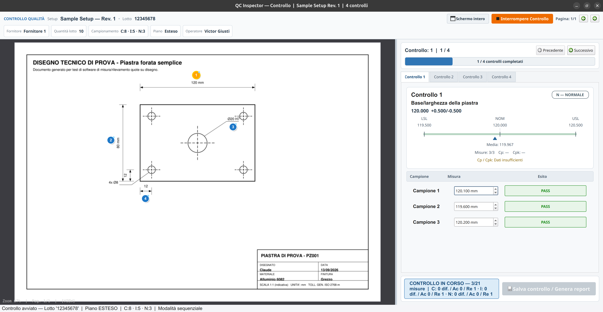
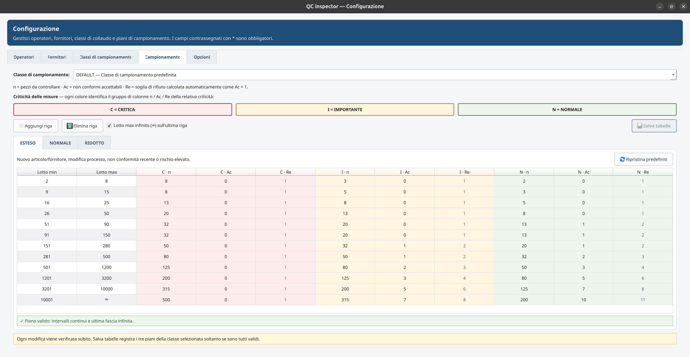

# QC Inspector — Controllo qualità da disegno tecnico

[](https://github.com/elBit0r/qc-inspector/actions/workflows/ci.yml)
[](https://github.com/elBit0r/qc-inspector/releases)
[](LICENSE)

**QC Inspector è un'applicazione desktop per programmare, eseguire e documentare
controlli qualità su componenti e prodotti utilizzando un disegno tecnico in
formato PDF come riferimento.**

Sul disegno si posizionano richiami numerati (**pallinature**) associati alle
caratteristiche da verificare, definendo tipo di controllo, valore nominale,
tolleranze e criticità.

Durante il collaudo l'operatore inserisce le misure rilevate oppure l'esito di
controlli Sì/No. Il software verifica automaticamente la conformità rispetto
ai criteri impostati e registra i risultati per lotto. Al termine può generare
un report PDF contenente le misure e il disegno pallinato.

**[Scarica il pacchetto `.deb` dalle release GitHub](https://github.com/elBit0r/qc-inspector/releases)**

## Funzioni principali

- **Pallinatura del disegno:** aggiunta, spostamento e riordino dei richiami sul PDF.
- **Controlli dimensionali e Sì/No:** definizione delle caratteristiche da verificare
  e della loro criticità: critica, importante o normale.
- **Setup riutilizzabili:** salvataggio del piano di controllo del componente, con
  revisioni che mantengono il riferimento usato nei collaudi precedenti.
- **Campionamento per lotto:** piani ESTESO, NORMALE e RIDOTTO configurabili,
  con quantità da controllare e soglie di accettazione distinte per criticità.
- **Registrazione delle misure:** inserimento per campione o per controllo,
  valutazione PASS/FAIL e gestione delle accettazioni in deroga.
- **Storico e report:** consultazione dei lotti, statistiche, valutazione dei
  fornitori e rigenerazione dei report PDF.
- **Etichette:** stampa opzionale dell'etichetta del lotto tramite CUPS.

## Come si usa

1. **Prepara il controllo.** In Programmazione crea un setup, carica il disegno
   PDF e seleziona la Classe di Collaudo. Posiziona le pallinature e definisci i
   controlli, includendone almeno uno critico. Premi **Applica controllo** per
   ciascuno e **Salva setup** per registrare il lavoro.
2. **Avvia il collaudo.** Seleziona setup, fornitore, operatore e dati del lotto.
   Scegli il piano di campionamento e verifica la quantità di componenti da controllare.
3. **Misura i componenti.** Seguendo i richiami sul disegno, inserisci le misure
   rilevate o le risposte Sì/No. Il programma mostra gli esiti e l'avanzamento.
4. **Salva i risultati.** Completate le misure, premi **Salva controllo / Genera
   report**. Il lotto viene registrato nello storico; report PDF e stampa
   dell'etichetta sono facoltativi.

Le misure del collaudo restano in memoria fino al salvataggio finale.
Chiudendo o interrompendo il controllo prima di salvarlo, vengono perse dopo
la conferma dell'operatore.

## Schermate di esempio

Un esempio di controllo su una piastra forata.

### Programmazione

Pallinatura del disegno e definizione delle quote da controllare.



### Avvio del controllo

Dati del lotto e quantità da controllare in base al piano di campionamento.



### Misurazione dei componenti

Inserimento delle misure, esiti e confronto con i limiti di tolleranza.



### Piani di campionamento

Configurazione della numerosità del campione (n), della soglia di accettazione
(Ac) e della soglia di rifiuto (Re) per ciascuna criticità.



## Installazione e avvio

### Dai sorgenti

Il progetto dichiara **Python 3.10 o successivo** come requisito minimo.
I test locali sono stati eseguiti con **Python 3.14.4**; anche la CI è configurata
per questa versione. Le altre versioni non sono attualmente verificate dalla CI.
Dalla cartella del progetto:

```bash
python3 -m venv .venv
source .venv/bin/activate
pip install --editable .
python main.py
```

Le dipendenze Python vengono installate automaticamente. Con l'ambiente attivo
puoi avviare il programma anche con `qc-inspector`. In PyCharm puoi eseguire
il `main.py` nella root usando l'interprete del progetto.

Su Ubuntu, per il feedback audio:

```bash
sudo apt install libgstreamer1.0-0 libgstreamer-plugins-base1.0-0 gstreamer1.0-plugins-base gstreamer1.0-plugins-good
```

La stampa delle etichette richiede il client CUPS (`cups-client`) e una
stampante configurata.

### Da un pacchetto `.deb`

Apri la [pagina delle release](https://github.com/elBit0r/qc-inspector/releases)
e scarica il file `.deb` dalla sezione **Assets** della versione desiderata.
Consulta le note della release per i requisiti di sistema, quindi esegui dalla
cartella in cui hai salvato il pacchetto:

```bash
sudo apt install ./nome-pacchetto.deb
sudo usermod -aG qc-inspector "$USER"
```

Chiudi la sessione e rientra per attivare il gruppo, quindi avvia **QC Inspector**
dal menu delle applicazioni oppure con `qc-inspector`.

### Dall'archivio portable

Estrai l'archivio, entra nella cartella `qc-inspector`, copia
`qc_inspector.conf.sample` come `qc_inspector.conf` e avvia `./qc-inspector`.
Su Ubuntu sono necessarie le dipendenze audio indicate sopra.

## Configurazione e documentazione

Da **Configurazione** puoi gestire operatori, fornitori, classi e piani di
campionamento. Nella scheda **Opzioni** trovi stampante, copie delle etichette,
separatore decimale, suoni di esito e testo del footer dei report.

Il **Manuale d'uso** è disponibile nel launcher e nel
[file incluso nel progetto](src/qc_inspector/ISTRUZIONI_USO.md).
Per conservare e ripristinare database, disegni e configurazione, consulta
[BACKUP.md](BACKUP.md).

Per contribuire o segnalare problemi:
[CONTRIBUTING.md](CONTRIBUTING.md) · [SECURITY.md](SECURITY.md) ·
[CHANGELOG.md](CHANGELOG.md).

## Licenza

QC Inspector è distribuito sotto **GNU AGPL v3 soltanto** (`AGPL-3.0-only`).
Vedi [LICENSE](LICENSE) e [NOTICE.md](NOTICE.md).

Icone e piani di campionamento sono creazioni originali dell'autore. I suoni
provengono da sound-theme-freedesktop e mantengono le proprie licenze Creative
Commons. Attribuzioni, licenze delle dipendenze e indicazioni sui sorgenti
corrispondenti per la distribuzione dei binari sono in
[THIRD_PARTY_NOTICES.md](THIRD_PARTY_NOTICES.md).
